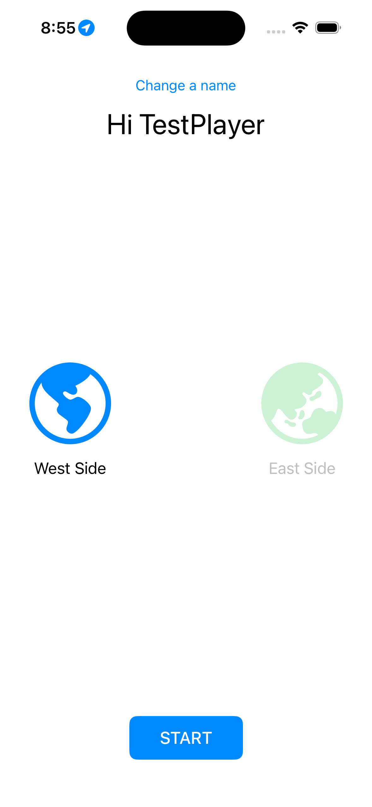
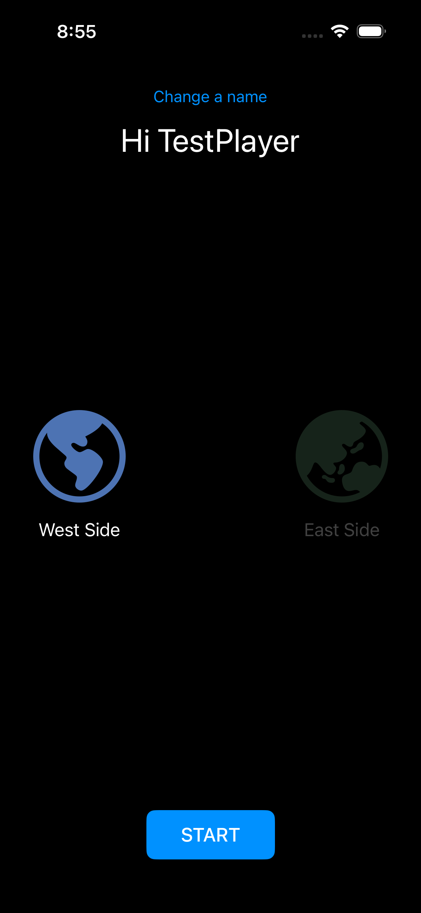
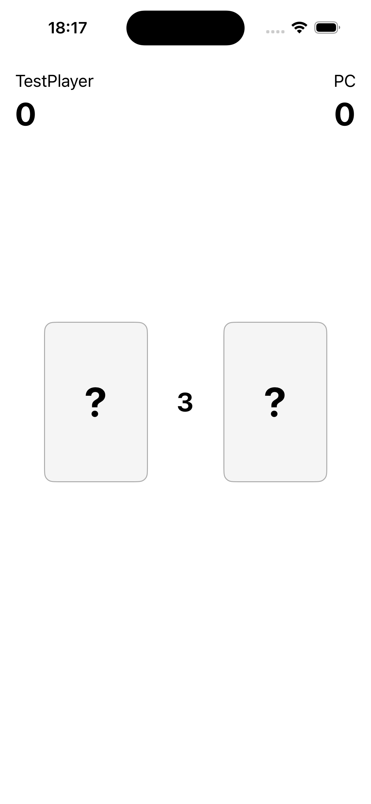
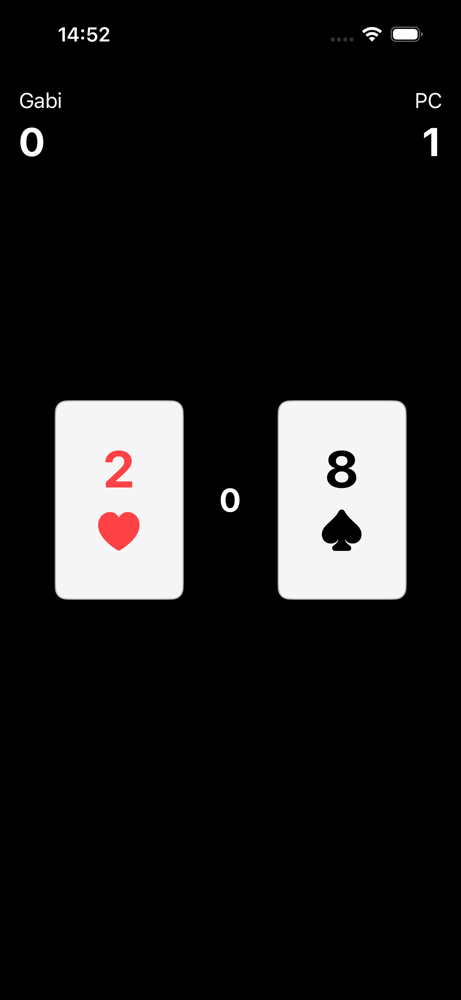

# CardGame

A two-player card game for iOS (UIKit). Enter your name, the app reads your
location to assign you East or West side, then you play 10 rounds of
high-card against the PC.

## Features
- Name entry, persisted between launches
- Location-based side assignment (midpoint longitude 34.817549168324334)
- 10-round card game with a 5s countdown + 3s reveal per round
- Portrait and landscape support
- Dark mode
- Background music + flip/win sound effects
- Correct pause/resume when the app is backgrounded mid-round

## Screenshots

| | Light | Dark |
|---|---|---|
| Menu |  |  |
| Game |  |  |
| Summary |  |  |

## Video
[Demo recording](Video/demo.mov)

## Requirements
- Xcode (see project settings for the exact version)
- iOS Simulator or device
